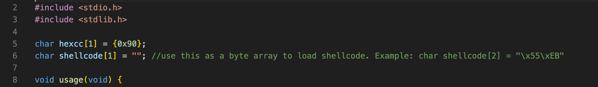

# SCLauncher - Basic Shellcode Tester and Debugger

This program is designed to load 32-bit or 64-bit shellcode and allow for execution or debugging. In addition, it can produce executable PE files based on the desired shellcode. This can ease testing as the output binary can be used by standard reverse engineering tools (i.e. IDA Pro (even free) and debuggers).


Release binaries are available. You can view a demo of this tool on [YouTube](https://youtu.be/U8SkM99TB2g)

## Compiling From Source

This program is intended to be compiled with the C/C++ compiler from Microsoft. You can use the `Developer Command Prompt` after installing the free/community version to compile using `cl`. An example of this command would be:

```cl sclauncher.c```

This will produce the exectuable ```sclauncher.exe```.

## Executing Shellcode From a File

You can use the ```-f``` argument to define a path to a file that contains shellcode. This will be copied into memory and executed. Additionally, you can use the ```-o``` argument to adjust the entry point by X bytes. This allows for shellcode that does not begin execution at the beginning of the binary blob. Finally, ```-bp``` determines if a breakpoint should be inserted before the shellcode. This will be done through a ```0xCC``` byte, which is an INT3. This allows you to run the program under a debugger, defining the command line arguments as appropriate. Inserting a breakpoint will allow the debugger to interrupt execution before the shellcode is executed. If you are *not* running under a debugger, do not insert a breakpoint as that will cause the program to crash.


## Executing Shellcode From an Internal Array

The source code also allows for the inclusion of shellcode through an internal array, named ```shellcode```. The bytes of shellcode must be copied into the array value and the size of the array adjusted. The program can then be compiled and executed - this mode does not support the ```-f``` argument.



## Producing a PE file

You can use the ```-pe``` argument to produce a PE file that essentially wraps the shellcode. The shellcode is placed in the ```.text``` section. The entry point is defined as the beginning of the section, unless the ```-ep``` argument is used. This argument will define an offset from the beginning of the section and be used to update the PE files entry point (i.e. AddressOfEntry field). Additionally, the ```-64``` argument can be used to generate a 64-bit PE file, likely for 64-bit shellcode. The resulting PE file can be analyzed via common reverse engineering tools such as IDA Pro, Ghidra or a debugger such as x32dbg/WinDbg/etc.

