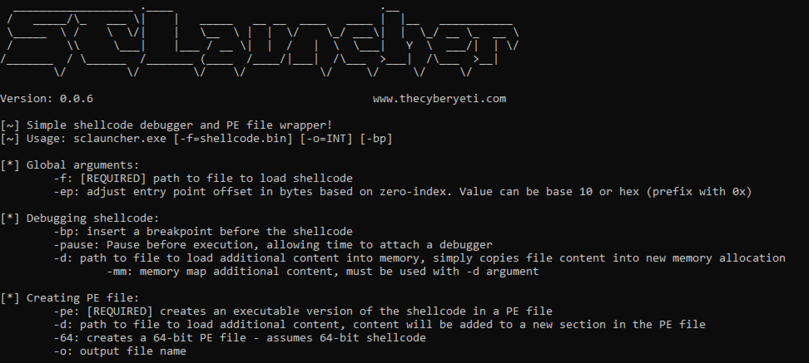

# SCLauncher - Basic Shellcode Tester, Debugger and PE-File Wrapper

This program is designed to load 32-bit or 64-bit shellcode and allow for execution or debugging. In addition, it can produce executable PE files based on the desired shellcode. This can ease testing as the output binary can be used by standard reverse engineering tools (i.e. IDA Pro (even free) and debuggers).



Release binaries are available. You can view a demo of this tool on [YouTube](https://youtu.be/U8SkM99TB2g)

This program provides several options for working with your shellcode:
* You can use the ```-pause``` argument to pause this program before executing the shellcode. This allows for a debugger to be attached and breakpoints to be set. Keep in mind that there are options available to have this utility set breakpoints for you, see the ```-bp``` argument.
* You can produce PE files from your shellcode, then disassemble or debug them as you would a normal PE file.
* You can run the the program directly under a debugger, providing the appropriate arguments through your debuggers interface.

## Executing Shellcode From a File

The only required argument is to provide the path to the file that contains your shellcode. You do that by using the ```-f``` argument. This will be copied into memory and executed. Additionally, you can use the ```-ep``` argument to adjust the entry point by X bytes. This allows for shellcode that does not begin execution at the beginning of the binary blob. Finally, ```-bp``` determines if a breakpoint should be inserted before the shellcode. This will be done through a ```0xCC``` byte, which is an INT3. This allows you to run the program under a debugger, defining the command line arguments as appropriate. Inserting a breakpoint will allow the debugger to interrupt execution before the shellcode is executed. If you are *not* running under a debugger, do not insert a breakpoint as that will cause the program to crash.


## Producing a PE file

You can use the ```-pe``` argument to produce a PE file that essentially wraps the shellcode. The shellcode is placed in the ```.text``` section. The entry point is defined as the beginning of the section, unless the ```-ep``` argument is used. This argument will define an offset from the beginning of the section and be used to update the PE files entry point (i.e. AddressOfEntry field). Additionally, the ```-64``` argument can be used to generate a 64-bit PE file, likely for 64-bit shellcode. The resulting PE file can be analyzed via common reverse engineering tools such as IDA Pro, Ghidra or a debugger such as x32dbg/WinDbg/etc.


## What if I have a char array?

If you have shellcode that is not already in a binary state, you can use CyberChef to convert that shellcode and download it as a file. 


Here is an example of shellcode from [Exploit-DB](https://www.exploit-db.com/exploits/48116) that was converted to binary content on [CyberChef](https://gchq.github.io/CyberChef/#recipe=From_Hex('Auto')To_Hexdump(16,false,false,false)&input=XHg4OVx4ZTVceDgzXHhlY1x4MjBceDMxXHhkYlx4NjRceDhiXHg1Ylx4MzBceDhiXHg1Ylx4MGNceDhiXHg1Ylx4MWNceDhiXHgxYlx4OGJceDFiXHg4Ylx4NDNceDA4XHg4OVx4NDVceGZjXHg4Ylx4NThceDNjXHgwMVx4YzNceDhiXHg1Ylx4NzhceDAxXHhjM1x4OGJceDdiXHgyMFx4MDFceGM3XHg4OVx4N2RceGY4XHg4Ylx4NGJceDI0XHgwMVx4YzFceDg5XHg0ZFx4ZjRceDhiXHg1M1x4MWNceDAxXHhjMlx4ODlceDU1XHhmMFx4OGJceDUzXHgxNFx4ODlceDU1XHhlY1x4ZWJceDMyXHgzMVx4YzBceDhiXHg1NVx4ZWNceDhiXHg3ZFx4ZjhceDhiXHg3NVx4MThceDMxXHhjOVx4ZmNceDhiXHgzY1x4ODdceDAzXHg3ZFx4ZmNceDY2XHg4M1x4YzFceDA4XHhmM1x4YTZceDc0XHgwNVx4NDBceDM5XHhkMFx4NzJceGU0XHg4Ylx4NGRceGY0XHg4Ylx4NTVceGYwXHg2Nlx4OGJceDA0XHg0MVx4OGJceDA0XHg4Mlx4MDNceDQ1XHhmY1x4YzNceGJhXHg3OFx4NzhceDY1XHg2M1x4YzFceGVhXHgwOFx4NTJceDY4XHg1N1x4NjlceDZlXHg0NVx4ODlceDY1XHgxOFx4ZThceGI4XHhmZlx4ZmZceGZmXHgzMVx4YzlceDUxXHg2OFx4MmVceDY1XHg3OFx4NjVceDY4XHg2M1x4NjFceDZjXHg2M1x4ODlceGUzXHg0MVx4NTFceDUzXHhmZlx4ZDBceDMxXHhjOVx4YjlceDAxXHg2NVx4NzNceDczXHhjMVx4ZTlceDA4XHg1MVx4NjhceDUwXHg3Mlx4NmZceDYzXHg2OFx4NDVceDc4XHg2OVx4NzRceDg5XHg2NVx4MThceGU4XHg4N1x4ZmZceGZmXHhmZlx4MzFceGQyXHg1Mlx4ZmZceGQw).


## Compiling From Source

This program is intended to be compiled with the C/C++ compiler from Microsoft. You can use the `Developer Command Prompt` after installing the free/community version to compile using `cl`. An example of this command would be:

```cl sclauncher.c```

This will produce the exectuable ```sclauncher.exe```.
